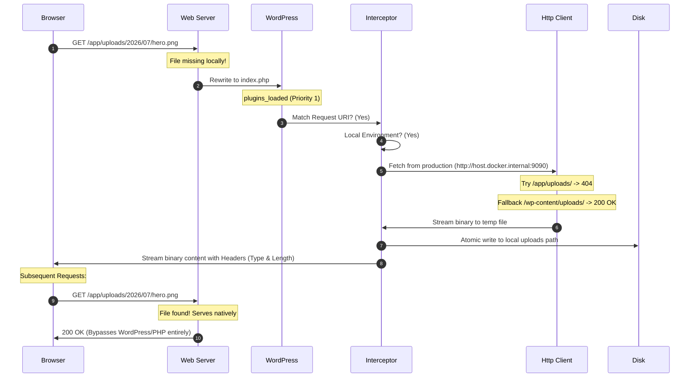

# TKA Media Proxy

[](https://wordpress.org)
[](https://php.net)
[](LICENSE.md)

**Stop wasting hours syncing massive production `uploads/` directories. Keep your local SSD light, your network fast, and your development feedback loop instantaneous.**

TKA Media Proxy is a strictly typed, object-oriented developer tool for WordPress that dynamically intercepts 404 media asset requests in local environments, proxies them from production on-demand, and mirrors them back to your local filesystem. Subsequent requests bypass PHP entirely, loading directly from your local disk.

---

## ⚡ The Problem & The Solution

*   **The Bloat:** Production sites frequently accumulate tens of gigabytes of media assets. Downloading these to local machines is slow, consumes storage, and causes project startup lag.
*   **The Dummy Option (302 Redirects):** Basic redirects trigger CORS errors, break headless API requests, and fail on local REST payloads.
*   **The Hybrid Solution:** TKA Media Proxy checks the local disk first. If the file is missing, it intercepts early in the boot lifecycle, streams the raw binary securely from production, saves it to the exact filesystem path, and sends the payload to the browser.

---

## 🚀 Key Features

*   **Zero-Database Footprint:** Runs early on the `plugins_loaded` hook (priority 1) to intercept media requests before WordPress executes heavy core database routing and option lookups.
*   **In-Memory Local Context Enforcement:** Strictly checks if it is running in a local setup (verifying env vars like `WP_ENV` / `WP_ENVIRONMENT_TYPE` or TLD extensions such as `.local`, `.test`, `.ddev.site`, `localhost`). Instantly short-circuits on staging or production to prevent execution.
*   **Smart Path Translation Fallback:** Automatically bridges folder structure mismatches. If your local site is built on Roots Bedrock (`/app/uploads/`) but production uses standard WordPress (`/wp-content/uploads/`) or vice-versa, the client translates paths dynamically to guarantee successful retrievals.
*   **Binary-Safe Streaming & File Locking:** Utilizes cURL file-streaming via `wp_remote_get()` directly to temporary files, followed by an atomic rename. This prevents memory leaks on large PDFs/videos and ensures corrupt or empty files are never written on 404 responses.
*   **Spoofed User-Agent Protection:** Rotates browser headers to bypass production-level firewalls (Cloudflare, Wordfence) that block default WordPress cURL clients.
*   **Command Line Matrix:** A clean suite of WP-CLI commands under the `wp tka-proxy` namespace for setup, health checking, and cache purges.

---

## 📦 Architecture Workflow



---

## 🛠️ WP-CLI Control Matrix

Manage your proxy state cleanly via the terminal:

### 1. Configure production URL mapping
Configure the target remote origin URL and SSL verification preferences:
```bash
wp tka-proxy configure https://production-site.com --ssl-verify=true
```

### 2. View current configuration & status
Check active settings, test connectivity to your production origin, and view the current file count and size of your local uploads directory:
```bash
wp tka-proxy status
```

### 3. Clear local media cache
Wipe all downloaded assets recursively from the local uploads directory to free up space (safely prompts for confirmation unless `--yes` is specified):
```bash
wp tka-proxy clear
```

---

## 📂 Project Structure

```
tka-mediaproxy/
├── tka-mediaproxy.php    # Plugin Bootstrap & Class Autoloader
├── readme.txt            # WordPress.org Repository Metadata
├── README.md             # Developer documentation
└── src/
    ├── Cli/
    │   └── ProxyCommand.php  # WP-CLI Commands (configure, status, clear)
    ├── Core/
    │   ├── Config.php        # DB Options & Constants Access layer
    │   └── Interceptor.php   # Early lifecycle request Router & File Streamer
    └── Http/
        └── Client.php        # Streaming HTTP Client (User-Agent Spoofing)
```

---

## ⚙️ Requirements & Variables

*   **PHP:** 8.2+
*   **WordPress:** 6.2+
*   **Config Overrides (Optional):** Define these in your `wp-config.php` to lock configurations across your local dev team:
    ```php
    define('TKA_MEDIA_PROXY_PRODUCTION_URL', 'https://example.com');
    define('TKA_MEDIA_PROXY_SSL_VERIFY', false); // Disable SSL verification on local self-signed setups
    ```

---

## 📄 License
This project is licensed under the GPLv2 or later License. See [LICENSE.md](LICENSE.md) or visit the GNU website for details.
